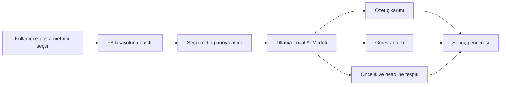

<h1 align="center">🚀 Email Decision Engine</h1>

<h3 align="center">
Seçilen e-posta metnini F8 kısayolu ile analiz eden yapay zeka destekli görev çıkarım sistemi
</h3>

<p align="center">
  <b>Özet Çıkarma</b> •
  <b>Görev Analizi</b> •
  <b>Önceliklendirme</b> •
  <b>Deadline Tespiti</b>
</p>

<p align="center">
  Local AI: Ollama
</p>

---

<p align="center">
  <a href="https://github.com/denvercoder1/readme-typing-svg">
    
  </a>
</p>

## 🎯 Proje Amacı

Yoğun iş akışlarında e-postalar çoğu zaman uzun, dağınık ve takip edilmesi zor bilgiler içerir.  
Bu durum, yapılacak işlerin kaçırılmasına, önceliklerin net belirlenememesine ve teslim tarihlerinin gözden kaçmasına neden olabilir.

**Email Decision Engine**, seçilen bir e-posta metnini yapay zeka desteğiyle analiz ederek kullanıcıya daha düzenli ve aksiyon odaklı bir çıktı sunmak amacıyla geliştirilmiştir.

Uygulama, kullanıcı tarafından seçilen e-posta içeriğini **F8 kısayolu** ile doğrudan analiz eder ve aşağıdaki bilgileri çıkarır:

- E-postanın kısa özeti
- Yapılması gereken görevler
- Görevlerin öncelik seviyesi
- Her görev için deadline bilgisi
- Daha hızlı aksiyon almayı sağlayan düzenli çıktı yapısı

---


## 📸 Ekran Görüntüleri

### Mail Metni Seçimi


### Analiz Sonucu


## ⚡ Özellikler

- ✉️ Seçili e-posta metnini analiz etme
- ⌨️ F8 kısayolu ile doğrudan çalışma
- 🧠 Local AI desteği ile özet çıkarma
- 📋 Yapılacaklar listesi oluşturma
- 🔥 Önceliklendirme: `HIGH / MEDIUM / LOW`
- ⏱ Deadline tespiti
- 🪟 Sonucu masaüstü penceresinde gösterme
- 📋 Analiz sonucunu panoya kopyalama
- 💻 Ollama ile local model kullanımı

---

## 🧩 Sistem Mimarisi



## 🤖 Kullanılan Teknolojiler

| Teknoloji | Kullanım Amacı |
|---|---|
| Python | Ana uygulama dili |
| Tkinter | Sonuç penceresi / masaüstü arayüz |
| pynput | F8 kısayolunu dinleme |
| pyautogui | Seçili metni kopyalama işlemi |
| pyperclip | Pano işlemleri |
| Requests | Ollama API bağlantısı |
| Ollama | Local AI model çalıştırma |
| Batch Script | Kurulum ve başlatma otomasyonu |

---

## 🏠 Local AI Kullanımı - Ollama

Bu proje local yapay zeka modeli ile çalışır.  
Öncelikle bilgisayarda **Ollama** kurulu olmalıdır.

Model indirmek için:

```bat
ollama pull gemma3:1b
```

Kurulu modelleri kontrol etmek için:

```bat
ollama list
```

---

## 🚀 Uygulamayı Çalıştırma

Projeyi indirdikten sonra klasör içinde aşağıdaki dosyayı çalıştırın:

```bat
BASLAT.bat
```

Alternatif olarak Python ile doğrudan çalıştırmak için:

```bat
py main.pyw
```

Uygulama çalıştıktan sonra:

1. Analiz etmek istediğiniz e-posta metnini seçin.
2. Klavyeden **F8** tuşuna basın.
3. Uygulama seçili metni otomatik olarak analiz eder.
4. Sonuç ayrı bir pencerede gösterilir.

---

## 🧪 Test Senaryosu

**Input:**

```text
Merhaba,

Dünkü görüşmemize istinaden sistem hatalarının giderilmesi gerekiyor. 
Öncelikle sistem hatasını bugün içerisinde inceleyip çözebilirsek iyi olur.

Ayrıca performans iyileştirme analizi hazırlanmalı ve analiz sonuçları yarına kadar paylaşılmalıdır.

Hafta sonu yapılacak çalışma öncesinde gerekli hazırlıkların tamamlanmasını rica ederim.

Teşekkürler.
```

**Output:**

```text
Özet:
Dünkü görüşmeye istinaden sistem hatalarının giderilmesi, performans analizinin yapılması ve hafta sonu çalışması öncesi hazırlıkların tamamlanması talep edilmektedir.

Yapılacaklar:

1. Görev: Sistem hatasını incele ve gider.
   Öncelik: HIGH
   Deadline: Bugün içerisinde

2. Görev: Performans iyileştirme analizi hazırla.
   Öncelik: MEDIUM
   Deadline: Belirtilmemiş

3. Görev: Analiz sonuçlarını paylaş.
   Öncelik: MEDIUM
   Deadline: Yarına kadar

4. Görev: Hafta sonu çalışması öncesi hazırlıkları tamamla.
   Öncelik: HIGH
   Deadline: Hafta sonu çalışması öncesinde
```

---

## 📁 Proje Yapısı

```text
email-decision-engine/
│
├── main.pyw              # Email Decision Engine ana uygulama dosyası
├── BASLAT.bat            # Uygulamayı başlatan batch dosyası
├── kurulum.bat           # Sanal ortam ve paket kurulumu
├── requirements.txt      # Gerekli Python paketleri
├── README.md             # Proje açıklaması
└── screenshots/          # Ekran görüntüleri
```

---

## 🚀 Sonuç

Email Decision Engine, uzun ve dağınık e-postaları manuel olarak inceleme ihtiyacını azaltarak daha hızlı aksiyon alınmasını sağlar.  
Kullanıcı yalnızca e-posta metnini seçip **F8** tuşuna basarak özet, görev listesi, öncelik ve deadline bilgilerine ulaşabilir.

Bu sayede e-posta yönetimi daha düzenli, takip edilebilir ve aksiyon odaklı hale gelir.

---

## 👩‍💻 Geliştirici Notu

Bu proje, mevcut bir GitHub reposu fork edilerek geliştirilmiştir.  
Ana çalışma yapısı korunmuş, uygulamanın ana işlevi e-posta analizi ve görev çıkarımı üzerine yeniden tasarlanmıştır.

---


⭐ Projeyi beğendiysen yıldızlamayı unutma!